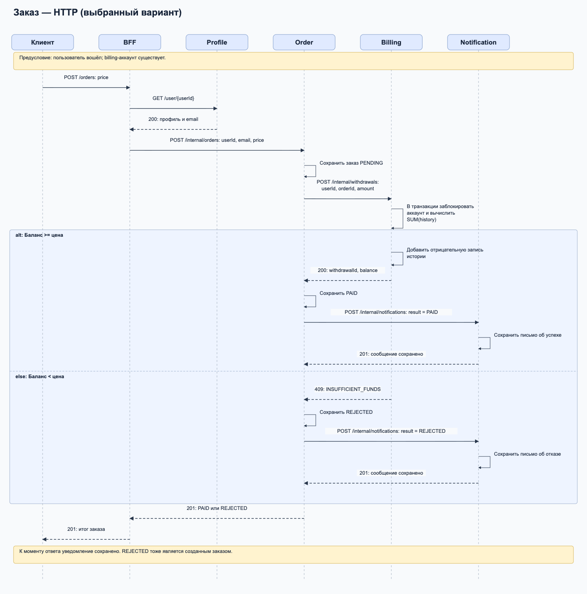

# Stream Processing

Выбран HTTP. BFF создаёт billing-аккаунт при регистрации. При заказе BFF получает
email из Profile, Order вызывает Billing, затем Notification. Ответ `201` приходит
после сохранения сообщения. Недостаток средств даёт заказ `REJECTED` и уведомление.



Контракты: [contracts.md](theory/contracts.md), [contracts.proto](theory/contracts.proto).

Все сервисы используют одну PostgreSQL и читают только свои таблицы.
Billing владеет `billing_accounts` и `balance_history`, Order — `orders`,
Notification — `notifications`. Связь с пользователем — `user_id` без внешнего
ключа на таблицу другого сервиса. Баланс — сумма `balance_history.amount`:
пополнение положительное, списание отрицательное. Суммы — целые минимальные единицы валюты.
Транзакция блокирует billing-аккаунт перед изменением истории.
Списание и уведомление уникальны по `order_id`; повтор с другими данными даёт `409`.
Каждый новый `POST /orders` создаёт новый заказ.

Profile, Auth и общий BFF находятся в `homework-k8s`. Здесь добавлены Billing,
Order и Notification. Общие Kubernetes-манифесты находятся в
`homework-k8s/k8s`, новые — в `homework-8/k8s`.

## Установка в Kubernetes

Образы опубликованы в Docker Hub и указаны в Deployment-манифестах.
Нужны kubectl, Helm 3 и Kubernetes-кластер; для локального запуска — Minikube.
Все команды выполняются из корня репозитория `health-service`.
Все компоненты устанавливаются в namespace **`yahu`**.
Пункты 1–2 можно пропустить, если кластер, PostgreSQL и NGINX Ingress уже работают.

### 1. Кластер Minikube

```bash
minikube start --memory=8192 --cpus=4
kubectl config use-context minikube
```

Для другого Kubernetes-кластера выберите его context вместо запуска Minikube.

### 2. Namespace, PostgreSQL и NGINX Ingress

```bash
kubectl create namespace yahu --dry-run=client -o yaml | kubectl apply -f -
kubectl apply -n yahu -f homework-k8s/k8s/secret.yaml

helm upgrade --install users-db \
  oci://registry-1.docker.io/bitnamicharts/postgresql \
  --version 18.8.0 --namespace yahu \
  --values homework-k8s/helm/postgresql/values.yaml --wait

helm upgrade --install nginx-ingress ingress-nginx \
  --repo https://kubernetes.github.io/ingress-nginx \
  --namespace yahu \
  --values homework-k8s/nginx-ingress.yaml \
  --set controller.metrics.serviceMonitor.enabled=false \
  --wait
```

ServiceMonitor отключён, чтобы установка не требовала Prometheus из предыдущего задания.

### 3. Конфигурация всех сервисов

```bash
kubectl apply -n yahu \
  -f homework-k8s/k8s/configmap.yaml \
  -f homework-k8s/k8s/auth-service-configmap.yaml \
  -f homework-k8s/k8s/bff-configmap.yaml \
  -f homework-8/k8s/billing-service-configmap.yaml \
  -f homework-8/k8s/order-service-configmap.yaml \
  -f homework-8/k8s/notification-service-configmap.yaml
```

### 4. Миграции

Удаление Job позволяет запустить миграции повторно; данные в БД сохраняются.

```bash
kubectl delete job -n yahu --ignore-not-found \
  health-service-migration \
  health-auth-service-migration \
  health-billing-service-migration \
  health-order-service-migration \
  health-notification-service-migration

kubectl apply -n yahu \
  -f homework-k8s/k8s/migration-job.yaml \
  -f homework-k8s/k8s/auth-service-migration-job.yaml \
  -f homework-8/k8s/billing-service-migration-job.yaml \
  -f homework-8/k8s/order-service-migration-job.yaml \
  -f homework-8/k8s/notification-service-migration-job.yaml

kubectl wait -n yahu --for=condition=complete --timeout=180s \
  job/health-service-migration \
  job/health-auth-service-migration \
  job/health-billing-service-migration \
  job/health-order-service-migration \
  job/health-notification-service-migration
```

Продолжайте после успешного завершения всех пяти Job.

### 5. Сервисы, Deployment и Ingress

```bash
kubectl apply -n yahu \
  -f homework-k8s/k8s/service.yaml \
  -f homework-k8s/k8s/auth-service-service.yaml \
  -f homework-k8s/k8s/bff-service.yaml \
  -f homework-8/k8s/billing-service-service.yaml \
  -f homework-8/k8s/order-service-service.yaml \
  -f homework-8/k8s/notification-service-service.yaml \
  -f homework-k8s/k8s/deployment.yaml \
  -f homework-k8s/k8s/auth-service-deployment.yaml \
  -f homework-k8s/k8s/bff-deployment.yaml \
  -f homework-8/k8s/billing-service-deployment.yaml \
  -f homework-8/k8s/order-service-deployment.yaml \
  -f homework-8/k8s/notification-service-deployment.yaml \
  -f homework-k8s/k8s/ingress.yaml
```

### 6. Проверка готовности

```bash
kubectl rollout status deployment/health-service -n yahu --timeout=180s
kubectl rollout status deployment/health-auth-service -n yahu --timeout=180s
kubectl rollout status deployment/health-billing-service -n yahu --timeout=180s
kubectl rollout status deployment/health-order-service -n yahu --timeout=180s
kubectl rollout status deployment/health-notification-service -n yahu --timeout=180s
kubectl rollout status deployment/health-bff -n yahu --timeout=180s
kubectl get pods,services,ingress,jobs -n yahu
```

### 7. Доступ к приложению

В отдельном терминале оставьте работающим port-forward:

```bash
kubectl port-forward -n yahu service/nginx-ingress-nginx-controller 8081:80
```

Добавьте в `/etc/hosts`: `127.0.0.1 arch.homework`.
В другом терминале:

```bash
curl http://arch.homework:8081/health/ready
```

Ожидаемый ответ: `{"status":"OK"}`.

## Postman и Newman

Коллекция: [orders.postman_collection.json](postman/orders.postman_collection.json).
Она выполняет сценарий выше, включая регистрацию, вход и проверку создания аккаунта.
Каждый запуск создаёт нового пользователя. Cookie сессии сохраняется автоматически.

Все URL используют `{{baseUrl}}`; начальное значение — `http://arch.homework`.
Для port-forward переопределяем адрес на `http://arch.homework:8081`.

Нужны Node.js и Newman. Установка Newman, если его ещё нет:

```bash
npm install -g newman@6.2.2
```

Запуск из корня репозитория при работающем port-forward:

```bash
newman run homework-8/postman/orders.postman_collection.json \
  --env-var baseUrl=http://arch.homework:8081 \
  --reporters cli \
  --verbose
```

Ожидаемый результат: **10 запросов, 10 проверок, 0 ошибок**.
