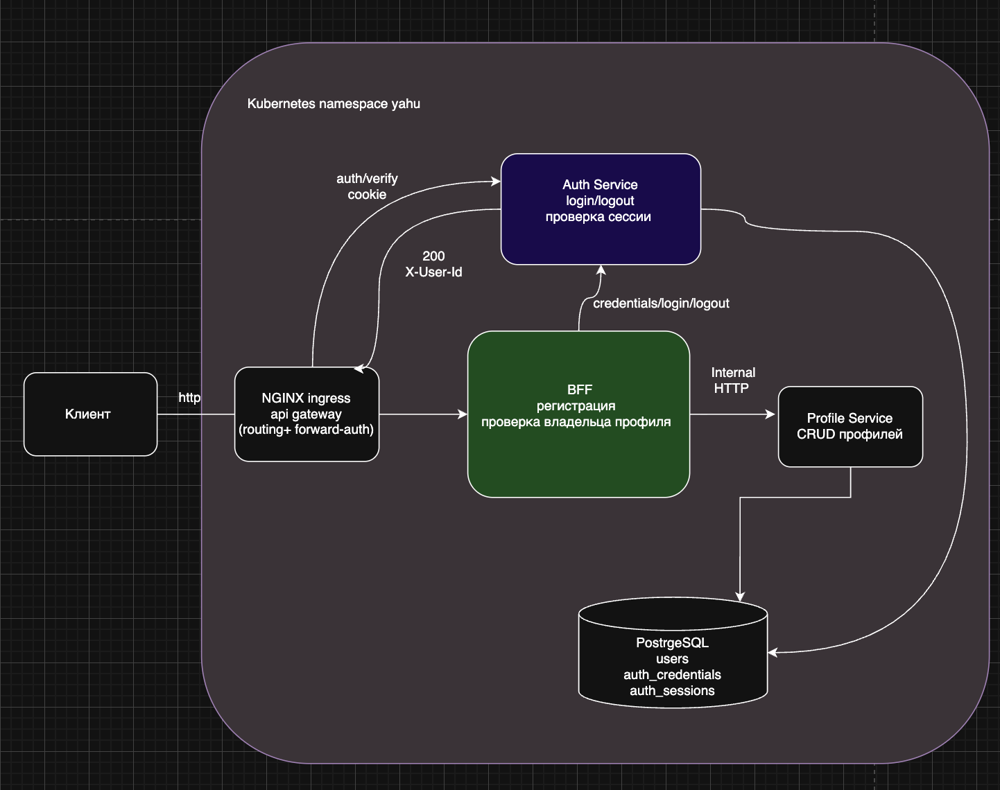

# Аутентификация и BFF

Регистрация, вход, чтение и изменение пользовательского профиля.
Общий BFF также обслуживает Billing, Order и Notification из
[homework-8](../homework-8/README.md). Namespace установки — **`yahu`**.



## Архитектура

Auth Service и BFF развёртываются как разные приложения. Публичной точкой входа
является NGINX Ingress, который выполняет роль API Gateway.

| Компонент | Ответственность |
|---|---|
| NGINX Ingress | маршрутизация и `forward-auth` для `/profile/*` |
| Auth Service | credentials, login/logout, создание и проверка серверных сессий |
| BFF | публичное API, регистрация, проверка владельца и вызовы внутренних сервисов |
| Profile Service | создание, чтение и изменение профилей |
| PostgreSQL | таблицы профилей, `auth_credentials` и `auth_sessions` |

Auth Service и Profile Service не вызывают друг друга. BFF оркестрирует
пользовательские сценарии и знает адреса обоих внутренних сервисов.

### Регистрация

1. Клиент вызывает `POST /auth/register` через API Gateway.
2. BFF создаёт профиль во внутреннем Profile Service.
3. BFF передаёт `userId`, username и пароль во внутренний Auth Service.
4. Auth Service хэширует пароль с помощью `scrypt` и сохраняет credentials.
5. BFF создаёт billing-аккаунт для пользователя.
6. Если credentials сохранить не удалось, BFF компенсирует операцию, удаляя
   созданный профиль.

### Login и сессия

1. BFF передаёт login-запрос во внутренний Auth Service.
2. Auth Service проверяет пароль и создаёт случайный session token.
3. В PostgreSQL сохраняется только SHA-256 хэш token.
4. Cookie `session_id` с флагами `HttpOnly` и `SameSite=Lax` возвращается клиенту
   через BFF и API Gateway.

JWT не используется: решение построено на серверных сессиях в PostgreSQL.

### Forward-auth и профиль

Для `GET/PUT /profile/{userId}` NGINX Ingress сначала выполняет внутренний запрос:

```text
GET http://health-auth-service.yahu.svc.cluster.local/auth/verify
```

Auth Service получает исходную cookie и отвечает:

- `401`, если сессия отсутствует, неизвестна или истекла;
- `200` и `X-User-Id`, если сессия действительна.

После успешной проверки Gateway передаёт исходный запрос в BFF и перезаписывает
`X-User-Id` значением из Auth Service. BFF сравнивает его с `userId` в URL:

- разные идентификаторы — `403 Forbidden`;
- идентификаторы совпадают — запрос передаётся в Profile Service.

Таким образом, новые защищённые маршруты можно подключать к тому же Auth Service
через `forward-auth`, не добавляя в каждый сервис работу с сессиями.

## Публичное API

| Метод | URL | Назначение |
|---|---|---|
| `POST` | `/auth/register` | регистрация пользователя |
| `POST` | `/auth/login` | вход и создание сессии |
| `POST` | `/auth/logout` | отзыв сессии и очистка cookie |
| `GET` | `/profile/{userId}` | чтение собственного профиля |
| `PUT` | `/profile/{userId}` | изменение собственного профиля |
| `GET` | `/health/live` | liveness probe BFF |
| `GET` | `/health/ready` | готовность BFF и внутренних сервисов |

Внутренние API Auth Service и маршруты `/user/*` Profile Service через Ingress
недоступны.

## Требования

- Docker;
- kubectl;
- Helm 3;
- Minikube с 8 ГБ памяти и 4 CPU;
- Newman для запуска Postman-тестов.

```bash
minikube start --memory=8192 --cpus=4
kubectl config use-context minikube
```

## Сборка образов

```bash
docker build \
  -t yahurt/health-auth-service:1.0.0 \
  homework-k8s/auth-service

docker build \
  -t yahurt/health-bff:2.0.0 \
  homework-k8s/bff
```

Для удалённого Kubernetes:

```bash
docker push yahurt/health-auth-service:1.0.0
docker push yahurt/health-bff:2.0.0
```

## Установка NGINX Ingress

Отдельное приложение API Gateway не требуется: его роль выполняет
`ingress-nginx`.

```bash
kubectl create namespace yahu --dry-run=client -o yaml | kubectl apply -f -

helm upgrade --install nginx-ingress ingress-nginx \
  --repo https://kubernetes.github.io/ingress-nginx \
  --namespace yahu \
  --values homework-k8s/nginx-ingress.yaml \
  --wait
```

## Установка базовых сервисов

Команды выполняются из корня репозитория. Namespace — `yahu`.
NGINX Ingress устанавливается командой из раздела выше.
Если PostgreSQL, Profile и Auth уже работают, переходите к
[установке новых сервисов и BFF](../homework-8/README.md#установка-в-kubernetes).

```bash
kubectl create namespace yahu --dry-run=client -o yaml | kubectl apply -f -
kubectl apply -f homework-k8s/k8s/secret.yaml

helm upgrade --install users-db \
  oci://registry-1.docker.io/bitnamicharts/postgresql \
  --version 18.8.0 --namespace yahu \
  --values homework-k8s/helm/postgresql/values.yaml --wait

kubectl apply -n yahu \
  -f homework-k8s/k8s/configmap.yaml \
  -f homework-k8s/k8s/auth-service-configmap.yaml

kubectl delete job -n yahu --ignore-not-found \
  health-service-migration health-auth-service-migration
kubectl apply -n yahu \
  -f homework-k8s/k8s/migration-job.yaml \
  -f homework-k8s/k8s/auth-service-migration-job.yaml
kubectl wait -n yahu --for=condition=complete --timeout=180s \
  job/health-service-migration job/health-auth-service-migration

kubectl apply -n yahu \
  -f homework-k8s/k8s/service.yaml \
  -f homework-k8s/k8s/auth-service-service.yaml \
  -f homework-k8s/k8s/deployment.yaml \
  -f homework-k8s/k8s/auth-service-deployment.yaml
kubectl rollout status deployment/health-service -n yahu --timeout=180s
kubectl rollout status deployment/health-auth-service -n yahu --timeout=180s
```

Далее выполните [команды установки Billing, Order, Notification и BFF](../homework-8/README.md#установка-в-kubernetes).

### Локальный доступ к Ingress в Minikube

Для Minikube с Docker driver на macOS:

```bash
kubectl port-forward \
  -n yahu \
  service/nginx-ingress-nginx-controller \
  8081:80
```

В `/etc/hosts` должна быть запись:

```text
127.0.0.1 arch.homework
```

Проверка:

```bash
curl http://arch.homework:8081/health/ready
```

## Postman и Newman

Коллекция: [`postman/auth-bff.postman_collection.json`](postman/auth-bff.postman_collection.json).

Она выполняет обязательный сценарий:

1. регистрирует пользователя №1 со случайными username, email и паролем;
2. проверяет запрет чтения и изменения профиля без login (`401`);
3. выполняет login пользователя №1;
4. изменяет профиль и проверяет сохранённые изменения;
5. выполняет logout;
6. регистрирует и авторизует пользователя №2;
7. проверяет запрет чтения и изменения профиля №1 пользователем №2 (`403`).

Начальное значение `{{baseUrl}}` — `http://arch.homework`. При каждом запуске
создаются случайные данные. Скрипты коллекции печатают метод, URL и тело запроса,
а также HTTP-статус и тело ответа в Newman CLI.

```bash
newman run homework-k8s/postman/auth-bff.postman_collection.json \
  --env-var baseUrl=http://arch.homework:8081 \
  --reporters cli \
  --verbose
```

Ожидаемый результат:

```text
requests:   11, failed: 0
assertions: 11, failed: 0
```
