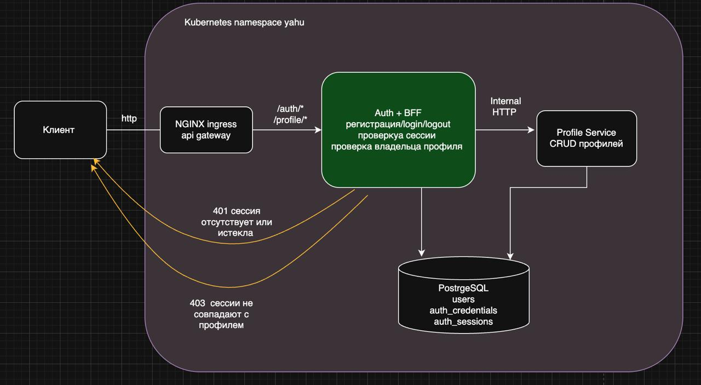

# Аутентификация и BFF

Безопасный сценарий регистрации, входа, чтения и изменения пользовательского
профиля. Namespace установки — **`yahu`**.



## Архитектура

Публичной точкой входа является NGINX Ingress с доменом `arch.homework`. Все
запросы направляются в Auth+BFF. Существующий Profile Service остаётся внутренним
`ClusterIP` и не публикуется через Ingress.

| Компонент | Ответственность |
|---|---|
| NGINX Ingress | публичная маршрутизация `arch.homework` в Auth+BFF |
| Auth+BFF | регистрация, login/logout, сессии, авторизация и вызовы Profile Service |
| Profile Service | создание, чтение и изменение профилей |
| PostgreSQL | `users`, `auth_credentials`, `auth_sessions` |

### Регистрация

1. Клиент вызывает `POST /auth/register`.
2. Auth+BFF хэширует пароль с помощью `scrypt` и уникальной соли.
3. Auth+BFF создаёт профиль через внутренний `POST /user` Profile Service.
4. Полученный `userId` связывается с credentials.
5. Если credentials сохранить не удалось, BFF выполняет компенсирующий внутренний
   `DELETE /user/{userId}`.

### Сессия и доступ к профилю

После login клиент получает случайный session token в cookie с флагами `HttpOnly`
и `SameSite=Lax`. В базе хранится только SHA-256 token. BFF получает `userId` из
сессии и сравнивает его с `userId` профиля:

- нет cookie, сессия неизвестна или истекла — `401 Unauthorized`;
- пользователь запрашивает чужой профиль — `403 Forbidden`;
- владелец профиля — запрос передаётся во внутренний Profile Service.

## Публичное API

| Метод | URL | Назначение |
|---|---|---|
| `POST` | `/auth/register` | регистрация пользователя |
| `POST` | `/auth/login` | вход и создание сессии |
| `POST` | `/auth/logout` | отзыв сессии и очистка cookie |
| `GET` | `/profile/{userId}` | чтение собственного профиля |
| `PUT` | `/profile/{userId}` | изменение собственного профиля |
| `GET` | `/health/live` | liveness probe Auth+BFF |
| `GET` | `/health/ready` | проверка БД и Profile Service |

Внутренние маршруты `/user/*` Profile Service через Ingress недоступны.

## Требования

- Docker;
- kubectl;
- Helm 3;
- Minikube с 8 ГБ памяти и 4 CPU;
- Newman для запуска Postman-тестов.

```bash
minikube start --memory=8192 --cpus=4
kubectl config use-context minikube
```

## Сборка Auth+BFF

Готовые манифесты используют `yahurt/health-auth-bff:1.0.0`:

```bash
docker build \
  -t yahurt/health-auth-bff:1.0.0 \
  homework-k8s/auth-bff
```

Для удалённого Kubernetes:

```bash
docker push yahurt/health-auth-bff:1.0.0
```

## Установка NGINX Ingress

Отдельный API Gateway не используется: его роль выполняет `ingress-nginx`.

```bash
kubectl create namespace yahu --dry-run=client -o yaml | kubectl apply -f -

helm upgrade --install nginx-ingress ingress-nginx \
  --repo https://kubernetes.github.io/ingress-nginx \
  --namespace yahu \
  --values homework-k8s/nginx-ingress.yaml \
  --wait
```

## Установка приложения

Все компоненты устанавливаются в namespace `yahu`. Команды выполняются из корня
репозитория `health-service`.

```bash
# Namespace и credentials существующего PostgreSQL
kubectl create namespace yahu --dry-run=client -o yaml | kubectl apply -f -
kubectl apply -f homework-k8s/k8s/secret.yaml

# PostgreSQL
helm upgrade --install users-db \
  oci://registry-1.docker.io/bitnamicharts/postgresql \
  --version 18.8.0 \
  --namespace yahu \
  --values homework-k8s/helm/postgresql/values.yaml \
  --wait

# Profile Service: конфигурация и миграция
kubectl apply -f homework-k8s/k8s/configmap.yaml
kubectl delete job health-service-migration -n yahu --ignore-not-found
kubectl apply -f homework-k8s/k8s/migration-job.yaml
kubectl wait --for=condition=complete \
  job/health-service-migration -n yahu --timeout=180s

# Profile Service без публичного Ingress
kubectl apply \
  -f homework-k8s/k8s/deployment.yaml \
  -f homework-k8s/k8s/service.yaml
kubectl rollout status \
  deployment/health-service -n yahu --timeout=180s

# Auth+BFF: конфигурация и миграция в тот же PostgreSQL
kubectl apply -f homework-k8s/k8s/auth-bff-configmap.yaml
kubectl delete job health-auth-bff-migration -n yahu --ignore-not-found
kubectl apply -f homework-k8s/k8s/auth-bff-migration-job.yaml
kubectl wait --for=condition=complete \
  job/health-auth-bff-migration -n yahu --timeout=180s

# Auth+BFF и публичный Ingress
kubectl apply \
  -f homework-k8s/k8s/auth-bff-deployment.yaml \
  -f homework-k8s/k8s/auth-bff-service.yaml \
  -f homework-k8s/k8s/ingress.yaml
kubectl rollout status \
  deployment/health-auth-bff -n yahu --timeout=180s
```

Проверка:

```bash
kubectl get pods,services,ingress,jobs -n yahu
kubectl logs job/health-auth-bff-migration -n yahu
```

### Локальный доступ к Ingress в Minikube

Для Minikube с Docker driver на macOS удобно перенаправить порт Ingress Controller:

```bash
kubectl port-forward \
  -n yahu \
  service/nginx-ingress-nginx-controller \
  8081:80
```

В `/etc/hosts` должна быть запись:

```text
127.0.0.1 arch.homework
```

Проверка маршрута:

```bash
curl http://arch.homework:8081/health/ready
```

## Postman и Newman

Коллекция: [`postman/auth-bff.postman_collection.json`](postman/auth-bff.postman_collection.json).

Она выполняет обязательный сценарий:

1. регистрирует пользователя №1 со случайными username, email и паролем;
2. проверяет запрет чтения и изменения профиля без login (`401`);
3. выполняет login пользователя №1;
4. изменяет профиль и проверяет сохранённые изменения;
5. выполняет logout;
6. регистрирует и авторизует пользователя №2;
7. проверяет запрет чтения и изменения профиля №1 пользователем №2 (`403`).

Начальное значение `{{baseUrl}}` в коллекции — `http://arch.homework`. При каждом
запуске генерируется новый UUID. Collection-level scripts печатают метод, URL, тело
запроса, HTTP-статус и тело ответа в Newman CLI.

Запуск при обычном доступе на порту 80:

```bash
newman run homework-k8s/postman/auth-bff.postman_collection.json \
  --reporters cli \
  --verbose
```

Запуск через локальный port-forward `8081`:

```bash
newman run homework-k8s/postman/auth-bff.postman_collection.json \
  --env-var baseUrl=http://arch.homework:8081 \
  --reporters cli \
  --verbose
```

Ожидаемый результат:

```text
requests:   11, failed: 0
assertions: 11, failed: 0
```

## Безопасность

- пароли хэшируются `scrypt` и никогда не передаются в Profile Service;
- session token генерируется криптографически стойким генератором;
- в БД хранится только SHA-256 session token;
- cookie устанавливается с `HttpOnly` и `SameSite=Lax`;
- доступ к профилю разрешается только при совпадении session `userId` с URL;
- контейнеры Auth+BFF запускаются с UID/GID `1000`, без Linux capabilities;
- Profile Service не имеет публичного Ingress.

Для учебного HTTP-домена установлено `COOKIE_SECURE=false`. При использовании TLS
необходимо установить `COOKIE_SECURE=true`.
